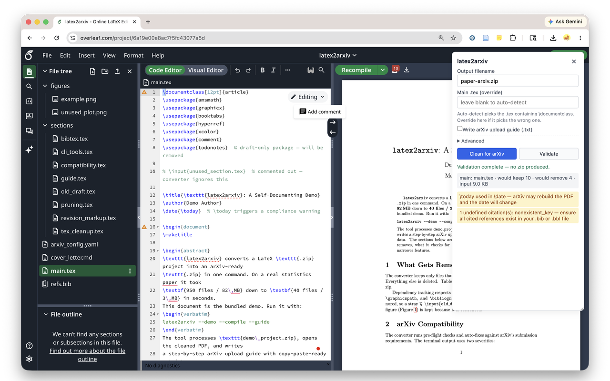
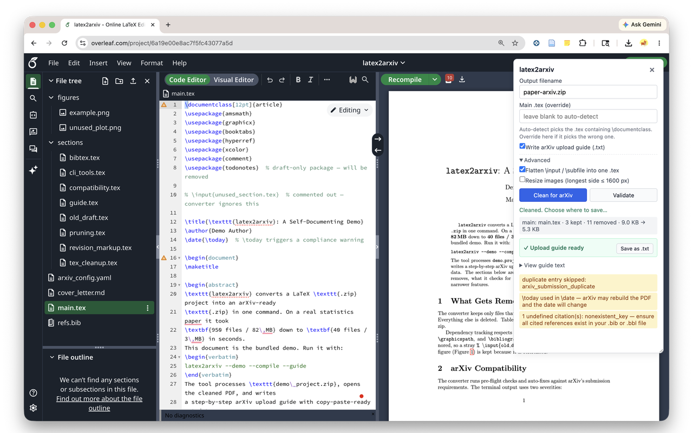
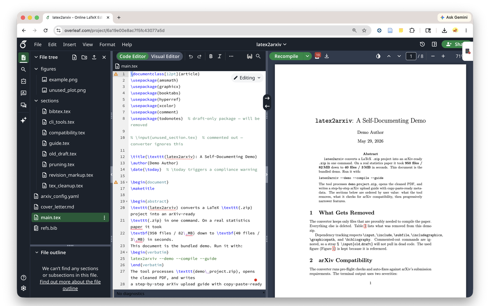

# latex2arxiv for Overleaf

Validate and clean your LaTeX project for arXiv submission — without leaving the Overleaf editor. A side panel runs arXiv's pre-flight checks and produces a clean submission zip. Everything runs locally in your browser; your manuscript never leaves your machine.

> Part of [`latex2arxiv`](https://github.com/YuZh98/latex2arxiv) — the command-line tool, MCP server, and VS Code extension share the same pipeline.

## Install

**[Get it on the Chrome Web Store](https://chromewebstore.google.com/detail/latex2arxiv-for-overleaf/oeaoajmhcmlgdbeacnpkcofodekkpeab)**

Or [run it from source](#development).

## What it looks like

Open any Overleaf project and the panel docks to the bottom-right corner.

### Validate



See every problem arXiv would flag — forbidden packages, missing `.bbl`, oversized figures, hidden files, deprecated commands — listed right in the panel. This only reports problems; it produces no zip.

### Clean for arXiv



Strip TODO comments, drop unreferenced figures, flatten `\input`/`\subfile`, optionally downsize images, then download a clean `.zip` ready to upload. You can also save a short upload guide (`.txt`) listing the title, authors, abstract, page count, and the files that were kept.

### Collapse it



Collapse the panel to a pill on the right edge when you don't need it — the full editor stays visible.

## Privacy

Your manuscript never leaves your browser. The extension sends nothing to any server we operate and makes no network call to fetch code or data at runtime — the Python runtime and every dependency are packaged inside the extension itself. Full policy: [`PRIVACY.md`](PRIVACY.md).

---

## For developers

### Status

**Live on the Chrome Web Store.** The UI, service worker, offscreen document, and Web Worker run the full `latex2arxiv` pipeline via Pyodide against an open Overleaf project. The Pyodide runtime and the four packages it ships are vendored under `pyodide/` (~13 MB) so the package is self-contained per the MV3 remote-code policy. Every bundled wheel and runtime file is sha256-pinned and re-verified in CI.

Design rationale, dismissed alternatives, and the full build plan: [`docs/browser-extension-design.md`](../docs/browser-extension-design.md).

### Architecture

Four execution contexts, each forced by a hard browser constraint:

| Context | File | Responsibility |
|---|---|---|
| Content script | `content.js` | Inject the panel UI; route user actions to the service worker; render diagnostics |
| Service worker | `background.js` | Manage the offscreen document; relay run requests; dispatch the download and revoke handshake |
| Offscreen document | `offscreen.js` | Fetch the project zip from Overleaf (using your session cookies); spawn the worker; return a blob URL |
| Web Worker | `worker.js` | Run Pyodide and the `latex2arxiv` Python pipeline |

Why an offscreen document: Overleaf's content-security policy refuses to spawn a Web Worker from a `chrome-extension://` URL inside the page, so the worker lives in an offscreen document, which owns its own CSP.

### Development

1. Visit `chrome://extensions/`.
2. Toggle **Developer mode** on.
3. Click **Load unpacked** and pick this directory.
4. Open any Overleaf project. The panel appears.

No build step — source files and bundled wheels load as-is.

### Bundled wheels

`wheels/` contains the Python packages installed into Pyodide on first run:

| Wheel | Why bundled |
|---|---|
| `latex2arxiv-*.whl` | This project's own pipeline |
| `bibtexparser-*.whl` | Used by `pipeline/bibtex.py`; PyPI ships an sdist only, and micropip cannot build sdists in-browser |
| `pyparsing-*.whl` | Transitive dependency of `bibtexparser` |

Pillow, PyYAML, `regex`, and `micropip` ship under `pyodide/` alongside the runtime so `indexURL` resolves them locally — no network call at first install.

Rebuild the wheels with:

```sh
# from repo root
python -m build --wheel --outdir /tmp/l2a-wheel/ .
pip wheel 'bibtexparser>=1.4,<2' pyparsing --no-deps -w browser-extension/wheels/
cp /tmp/l2a-wheel/latex2arxiv-*.whl browser-extension/wheels/
```

### Vendored Pyodide

`pyodide/` holds a pinned subset of the Pyodide 0.29.4 release tarball: the runtime core plus the packages our pipeline transitively needs. `pyodide/integrity.json` records a sha256 for every file; `tests/vendored-integrity.test.mjs` re-verifies it in CI. Refresh after a Pyodide bump with `./scripts/vendor-pyodide.sh` (idempotent) — if a future `latex2arxiv` release pulls another Pyodide-managed dep, add the wheel filename to `PKG_WHEELS` in that script first.

Pyodide is © its contributors and distributed under the [Mozilla Public License 2.0](https://github.com/pyodide/pyodide/blob/main/LICENSE).

### Permissions

| Permission | Why |
|---|---|
| `host_permissions: https://www.overleaf.com/*` | Same-origin fetch of the project zip; content-script injection |
| `downloads` | Save the output zip via `chrome.downloads.download` |
| `storage` | Panel layout in `chrome.storage.local`; short-lived `downloadId → blob URL` map in `chrome.storage.session` so the service worker can revoke the URL after the download lands |
| `offscreen` | Host the Pyodide runtime in an offscreen document (see Architecture) |

No `<all_urls>`, no `tabs`, no `cookies`, no `nativeMessaging`, no `webRequest`.

### Tests

`tests/pyodide-smoke.mjs` boots Pyodide in Node, installs the bundled wheels, runs `converter.convert()` against a fixture, and asserts the output zip is non-trivial. Run from a full repo checkout — the fixture lives at the repo root:

```sh
cd browser-extension/tests
npm install
npm run smoke
```
